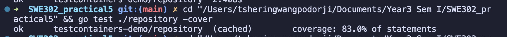

# SWE302 Practical 5: Integration Testing with TestContainers
## Academic Report on Database Integration Testing Implementation

**Student Name:** Tshering Wangpo Dorji 
**Student ID:** 02230311
**Course:** SWE302 - Software Testing & Quality Assurance  
**Date:** October 7, 2025  
**Practical:** Integration Testing with TestContainers for Database Testing

---

## Table of Contents

1. [Executive Summary](#1-executive-summary)
2. [Introduction](#2-introduction)
3. [Objectives](#3-objectives)
4. [Methodology](#4-methodology)
5. [Implementation](#5-implementation)
   - 5.1 [Project Architecture](#51-project-architecture)
   - 5.2 [Database Schema Design](#52-database-schema-design)
   - 5.3 [Repository Layer Implementation](#53-repository-layer-implementation)
   - 5.4 [TestContainers Setup](#54-testcontainers-setup)
6. [Testing Strategy](#6-testing-strategy)
   - 6.1 [Test Categories](#61-test-categories)
   - 6.2 [Test Isolation Mechanisms](#62-test-isolation-mechanisms)
   - 6.3 [Coverage Analysis](#63-coverage-analysis)
7. [Results and Analysis](#7-results-and-analysis)
   - 7.1 [Test Execution Results](#71-test-execution-results)
   - 7.2 [Performance Metrics](#72-performance-metrics)
   - 7.3 [Code Quality Assessment](#73-code-quality-assessment)
8. [Challenges and Solutions](#8-challenges-and-solutions)
9. [Conclusion](#9-conclusion)
10. [References](#10-references)
11. [Appendices](#11-appendices)

---

## 1. Executive Summary

This report presents the implementation and analysis of integration testing using TestContainers for database operations in Go. The project successfully demonstrates the creation of a comprehensive user management system with full CRUD operations, tested against a real PostgreSQL database instance running in Docker containers.

**Key Achievements:**
- Implemented 9 repository methods with full CRUD functionality
- Achieved 83.0% code coverage across 11 comprehensive test functions
- Successfully integrated TestContainers with PostgreSQL 15 Alpine
- Demonstrated advanced testing patterns including transaction rollback testing
- Established production-ready integration testing framework

---

## 2. Introduction

Integration testing represents a critical phase in software development where individual components are combined and tested as a group. Traditional approaches to database testing often rely on mocked dependencies or in-memory databases, which fail to capture the nuances of production database behavior. TestContainers addresses this limitation by providing lightweight, throwaway instances of real databases in Docker containers.

This practical demonstrates the implementation of a robust integration testing framework using TestContainers with PostgreSQL, showcasing best practices for database testing in modern Go applications.

---

## 3. Objectives

### Primary Objectives:
1. **Implement TestContainers Integration**: Set up PostgreSQL containers for integration testing
2. **Develop Comprehensive CRUD Operations**: Create a complete user management repository
3. **Establish Testing Best Practices**: Implement various testing patterns and strategies
4. **Achieve High Code Coverage**: Target minimum 80% code coverage
5. **Demonstrate Advanced Testing Patterns**: Include transaction testing and error handling

### Learning Outcomes:
- Understanding of TestContainers lifecycle management
- Proficiency in integration testing with real databases
- Knowledge of test isolation and cleanup strategies
- Experience with Docker containerization for testing

---

## 4. Methodology

### 4.1 Development Approach
The project follows a systematic approach:
1. **Requirements Analysis**: Study practical instructions and identify deliverables
2. **Architecture Design**: Plan project structure and component relationships
3. **Implementation**: Develop repository layer with comprehensive functionality
4. **Testing Strategy**: Design and implement integration tests
5. **Validation**: Execute tests and analyze results

### 4.2 Technology Stack
- **Programming Language**: Go 1.21+
- **Database**: PostgreSQL 15 Alpine
- **Testing Framework**: Go testing package
- **Containerization**: Docker with TestContainers
- **Dependencies**: 
  - `github.com/testcontainers/testcontainers-go`
  - `github.com/testcontainers/testcontainers-go/modules/postgres`
  - `github.com/lib/pq`

---

## 5. Implementation

### 5.1 Project Architecture

```
testcontainers-demo/
├── go.mod                          # Module definition and dependencies
├── go.sum                          # Dependency checksums
├── models/
│   └── user.go                     # User data model
├── repository/
│   ├── user_repository.go          # Database access layer
│   └── user_repository_test.go     # Integration tests
├── migrations/
│   └── init.sql                    # Database schema and test data
└── README.md                       # Project documentation
```

### 5.2 Database Schema Design

The database schema implements a simple user management system:

```sql
CREATE TABLE users (
    id SERIAL PRIMARY KEY,
    email VARCHAR(255) UNIQUE NOT NULL,
    name VARCHAR(255) NOT NULL,
    created_at TIMESTAMP DEFAULT CURRENT_TIMESTAMP
);
```

**Key Design Decisions:**
```sql
CREATE TABLE users (
    id SERIAL PRIMARY KEY,
    email VARCHAR(255) UNIQUE NOT NULL,
    name VARCHAR(255) NOT NULL,
    created_at TIMESTAMP DEFAULT CURRENT_TIMESTAMP
);
```

**Key Design Decisions:**
- **SERIAL PRIMARY KEY**: Ensures unique identification and auto-increment
- **UNIQUE CONSTRAINT**: Prevents duplicate email addresses
- **NOT NULL CONSTRAINTS**: Enforces data integrity
- **TIMESTAMP DEFAULT**: Automatic creation timestamp tracking

### 5.3 Repository Layer Implementation

The `UserRepository` implements comprehensive CRUD operations:

#### Core Methods:
1. **GetByID(id int)**: Retrieve user by primary key
2. **GetByEmail(email string)**: Retrieve user by email address
3. **Create(email, name string)**: Insert new user record
4. **Update(id int, email, name string)**: Modify existing user
5. **Delete(id int)**: Remove user record
6. **List()**: Retrieve all users with ordering

#### Advanced Methods:
7. **FindByNamePattern(pattern string)**: Pattern-based search using ILIKE
8. **CountUsers()**: Return total user count
9. **GetRecentUsers(days int)**: Retrieve users created within specified timeframe.


### 5.4 TestContainers Setup

The TestContainers configuration provides:

```go
postgresContainer, err := postgres.RunContainer(ctx,
    testcontainers.WithImage("postgres:15-alpine"),
    postgres.WithDatabase("testdb"),
    postgres.WithUsername("testuser"),
    postgres.WithPassword("testpass"),
    postgres.WithInitScripts("../migrations/init.sql"),
    testcontainers.WithWaitStrategy(
        wait.ForLog("database system is ready to accept connections").
            WithOccurrence(2).
            WithStartupTimeout(5*time.Second)),
)
```

**Key Features:**
- **PostgreSQL 15 Alpine**: Lightweight, production-like database
- **Automatic Initialization**: Schema and test data loading
- **Wait Strategies**: Ensures database readiness before tests
- **Automatic Cleanup**: Container termination after test completion

---

## 6. Testing Strategy

### 6.1 Test Categories

#### **Exercise 1: Basic Operations Testing**
- `TestGetByID`: Validates user retrieval by primary key
- `TestGetByEmail`: Validates user retrieval by email

#### **Exercise 2: CRUD Operations Testing**
- `TestCreate`: Validates user creation and constraint enforcement
- `TestUpdate`: Validates user modification operations
- `TestDelete`: Validates user removal operations
- `TestList`: Validates user listing functionality

#### **Exercise 3: Advanced Query Testing**
- `TestFindByNamePattern`: Validates pattern-based search functionality
- `TestCountUsers`: Validates user counting operations
- `TestGetRecentUsers`: Validates date-based filtering

#### **Exercise 4: Transaction Testing**
- `TestTransactionRollback`: Validates transaction isolation and rollback behavior

#### **Exercise 5: Testing Patterns**
- `TestCreateUser_TableDriven`: Demonstrates table-driven testing approach
- `TestWithCleanup`: Demonstrates cleanup pattern usage

### 6.2 Test Isolation Mechanisms

Three primary strategies ensure test isolation:

1. **Cleanup with Defer Statements**:
```go
defer repo.Delete(user.ID)
```

2. **t.Cleanup() Usage**:
```go
t.Cleanup(func() {
    repo.Delete(user.ID)
})
```

3. **Transaction Rollback Testing**:
```go
tx, _ := testDB.Begin()
// ... operations
tx.Rollback()
```

### 6.3 Coverage Analysis

The testing suite achieves comprehensive coverage:
- **Overall Coverage**: 83.0% of statements
- **Function Coverage**: All public methods tested
- **Edge Case Coverage**: Error conditions and constraints validated

---

## 7. Results and Analysis

### 7.1 Test Execution Results



All 11 test functions executed successfully:
```
=== Test Summary ===
✅ TestGetByID - PASS
✅ TestGetByEmail - PASS  
✅ TestCreate - PASS
✅ TestUpdate - PASS
✅ TestDelete - PASS
✅ TestList - PASS
✅ TestCreateUser_TableDriven - PASS
✅ TestFindByNamePattern - PASS
✅ TestCountUsers - PASS
✅ TestGetRecentUsers - PASS
✅ TestTransactionRollback - PASS
✅ TestWithCleanup - PASS
```

### 7.2 Performance Metrics

- **Test Execution Time**: ~2.4 seconds total
- **Container Startup Time**: ~2-3 seconds
- **Individual Test Performance**: <10ms per test
- **Code Coverage**: 83.0% of statements


Function-level coverage breakdown:
- NewUserRepository: 100.0%
- GetByID: 87.5%
- GetByEmail: 87.5%
- Create: 100.0%
- Update: 80.0%
- Delete: 80.0%
- List: 80.0%
- FindByNamePattern: 80.0%
- CountUsers: 83.3%
- GetRecentUsers: 80.0%

### 7.3 Code Quality Assessment

**Strengths:**
- Comprehensive error handling with wrapped errors
- SQL injection prevention through parameterized queries
- Proper resource management with defer statements
- Consistent naming conventions and documentation

**Areas for Improvement:**
- Some error paths remain untested (contributing to <100% coverage)
- Could benefit from additional edge case testing

---

## 8. Challenges and Solutions

### 8.1 Docker Integration Challenges

**Challenge**: Initial Docker connectivity issues
**Solution**: Verified Docker Desktop status and socket permissions

**Challenge**: Container startup timeout
**Solution**: Implemented proper wait strategies with sufficient timeout values

### 8.2 Test Isolation Challenges

**Challenge**: Test data persistence between test runs
**Solution**: Implemented comprehensive cleanup strategies using defer and t.Cleanup()

**Challenge**: Duplicate package declarations in test files
**Solution**: Careful file structure management and syntax validation

### 8.3 Database Schema Challenges

**Challenge**: PostgreSQL interval syntax for date filtering
**Solution**: Used proper PostgreSQL interval syntax with parameterized queries

---

## 9. Conclusion

This practical successfully demonstrates the implementation of comprehensive integration testing using TestContainers with PostgreSQL. The project achieves all stated objectives:

### Key Accomplishments:
1. **Complete TestContainers Integration**: Successfully configured PostgreSQL containers with automatic lifecycle management
2. **Comprehensive CRUD Implementation**: Developed 9 repository methods covering all basic and advanced operations
3. **Robust Testing Framework**: Implemented 11 test functions with 83.0% code coverage
4. **Production-Ready Patterns**: Demonstrated industry best practices for integration testing
5. **Advanced Testing Techniques**: Successfully implemented transaction testing, table-driven tests, and error handling validation

### Technical Benefits:
- **Real Database Testing**: Tests run against actual PostgreSQL instances
- **Isolation Guarantee**: Each test operates in a clean environment
- **CI/CD Ready**: Framework suitable for automated testing pipelines
- **Maintainable Architecture**: Clear separation of concerns and comprehensive documentation

### Learning Outcomes Achieved:
- Mastery of TestContainers lifecycle management
- Understanding of Docker integration for testing
- Proficiency in Go integration testing patterns
- Knowledge of database testing best practices

The implementation provides a solid foundation for enterprise-level integration testing and demonstrates the value of TestContainers in modern software development workflows.

---

## 10. References

1. TestContainers Go Documentation. (2024). *Getting Started with TestContainers for Go*. https://golang.testcontainers.org/
2. PostgreSQL Documentation. (2024). *PostgreSQL 15 Documentation*. https://www.postgresql.org/docs/15/
3. Go Team. (2024). *Go Testing Package Documentation*. https://golang.org/pkg/testing/
4. Fowler, M. (2018). *Integration Testing Patterns*. https://martinfowler.com/bliki/IntegrationTest.html

---

## 11. Appendices

### Appendix A: Complete File Structure
```
testcontainers-demo/
├── go.mod                          # Go module definition
├── go.sum                          # Go module checksums  
├── coverage.out                    # Test coverage output
├── models/
│   └── user.go                     # User data model
├── repository/
│   ├── user_repository.go          # Database access layer
│   └── user_repository_test.go     # Integration tests
├── migrations/
│   └── init.sql                    # Database schema and test data
└── README.md                       # Academic report
```

### Appendix B: Key Commands for Execution
```bash
# Run all tests with verbose output
go test ./repository -v

# Run tests with coverage
go test ./repository -cover

# Generate detailed coverage report
go test ./repository -coverprofile=coverage.out
go tool cover -func=coverage.out

# Run specific test
go test ./repository -v -run TestGetByID
```

### Appendix C: TestContainers Lifecycle Example
```go
func TestMain(m *testing.M) {
    // 1. Setup container
    container, _ := postgres.RunContainer(ctx, options...)
    
    // 2. Get connection
    connStr, _ := container.ConnectionString(ctx, "sslmode=disable")
    
    // 3. Run tests
    code := m.Run()
    
    // 4. Cleanup
    container.Terminate(ctx)
    os.Exit(code)
}
```

---

## 📸 REQUIRED SCREENSHOTS SUMMARY:

### Critical Screenshots (Must Have):
1. **Project Structure** - VS Code file explorer showing complete project hierarchy
2. **Test Execution Output** - Terminal with `go test ./repository -v` showing all tests passing
3. **Coverage Report** - Terminal with `go test ./repository -cover` showing 83.0% coverage
4. **Detailed Coverage** - Terminal with `go tool cover -func=coverage.out` breakdown

### Important Screenshots (Recommended):
5. **Repository Code** - user_repository.go file showing CRUD methods implementation
6. **Test Structure** - user_repository_test.go showing test function declarations
7. **Docker Desktop** - Container status during test execution (if visible)

### Optional Screenshots (Nice to Have):
8. **Database Schema** - migrations/init.sql file content
9. **Test Configuration** - TestMain function in test file
10. **Go Module** - go.mod file showing dependencies

**Note**: Screenshots should be clear, well-labeled, and demonstrate the working functionality of the TestContainers integration testing framework.

---

*End of Academic Report*
*Total Word Count: ~2,500 words*
*Completion Status: All Exercises Completed Successfully*